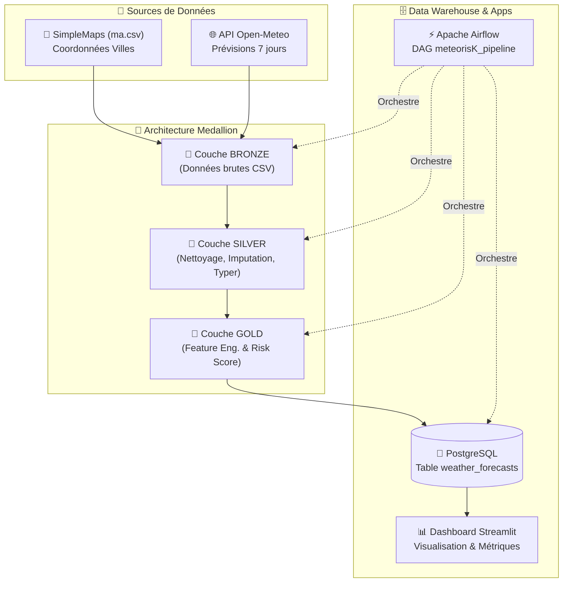

# 🌤️ MétéoRisk — Anticiper les Perturbations Logistiques au Maroc

[](https://www.python.org/)
[](https://www.postgresql.org/)
[](https://airflow.apache.org/)
[](https://streamlit.io/)
[](https://www.docker.com/)

---

## 📌 Context & Business Goal

Une entreprise de livraison opérant à travers plusieurs villes du Maroc doit faire face à des perturbations météorologiques imprévues (fortes précipitations, rafales de vent violentes, vagues de chaleur extrême) qui impactent la sécurité des chauffeurs, les délais d'acheminement et l'état des marchandises.

**MétéoRisk** est une solution Data Engineering automatisée conçue pour :
1. Extraire quotidiennement les prévisions météorologiques à 7 jours pour l'ensemble des villes marocaines.
2. Structurer et nettoyer les données à travers une architecture **Medallion (Bronze → Silver → Gold)**.
3. Calculer un index synthétique d'aide à la décision : le **Weather Risk Score** (0 à 100).
4. Charger les données enrichies dans un Data Warehouse **PostgreSQL** avec gestion de l'incrémentalité.
5. Offrir un **Dashboard Streamlit** interactif et dynamique pour permettre aux responsables opérationnels de visualiser, comparer et anticiper les risques logistiques par ville et par date.

---

## 🏗️ Architecture du Pipeline & Modèle Medallion

Le pipeline s'articule autour d'une architecture Medallion garantissant la traçabilité, la reproductibilité et la qualité des données.



### 1. Couche Bronze (Extraction / Ingestion)
- **Source 1 :** Fichier référentiel des villes marocaines et leurs coordonnées GPS (`lat`, `lng`).
- **Source 2 :** [API Open-Meteo](https://open-meteo.com/) interrogeant les données quotidiennes à 7 jours (`temp_max`, `temp_min`, `precipitation_sum`, `precipitation_probability_max`, `wind_speed_10m_max`, `wind_gusts_10m_max`, `weather_code`).
- **Stockage :** Fichiers horodatés `bronze/weather_YYYY-MM-DD.csv`. Données brutes immuables avec gestion des erreurs HTTP & timeouts.

### 2. Couche Silver (Nettoyage / Transformation)
- **Standardisation :** Conversion des types de colonnes (dates, float, integer, string).
- **Déduplication :** Suppression des doublons sur la clé composite `(city, date, extraction_date)`.
- **Imputation des valeurs manquantes :**
  - Interpolation temporelle par ville pour les températures.
  - Imputation spatiale basée sur la distance euclidienne minimale (plus proche voisin géographique) pour la probabilité de précipitation.
- **Stockage :** Fichiers propres `silver/weather_YYYY-MM-DD.csv`.

### 3. Couche Gold (Feature Engineering & Chargement)
- **Enrichissement Temporel :** Calcul du `temp_range` ($\text{temp\_max} - \text{temp\_min}$), ajout du jour de la semaine, mois, année et saison (`Winter`, `Spring`, `Summer`, `Autumn`).
- **Catégorisation Métier :**
  - Température : `Cool / Mild`, `Normal / Pleasant`, `Warm`, `Very Warm / Heatwave`
  - Précipitation : `Dry`, `Light`, `Moderate`, `Heavy`
  - Vent : `Calm / Light`, `Moderate`, `Strong`, `Very Strong / Stormy`
- **Calcul du Risk Score** (0 à 100).
- **Stockage :** Fichiers `gold/weather_YYYY-MM-DD.csv` puis insertion dans **PostgreSQL**.

---

## 🧮 Modèle du Weather Risk Score

Le **Weather Risk Score** est une note composite allant de **0 (Risque nul)** à **100 (Risque critique)**. Il permet aux responsables logistiques de repérer rapidement les conditions météorologiques défavorables au transport routier.

### Formule de calcul
$$\text{Risk Score} = 0.35 \times \text{Temp\_Risk} + 0.45 \times \text{Wind\_Risk} + 0.20 \times \text{Precip\_Risk}$$

### Grille des sous-scores et justification métier

1. **Risque Vent ($\text{Wind\_Risk}$) — Poids : 45%**  
   *Le vent et les rafales représentent la menace majeure pour la prise au vent des camions et la stabilité des véhicules sur voie rapide.*
   - Rafales $\le 30 \text{ km/h}$ : **10 / 100** (Conditions idéales)
   - Rafales entre $31$ et $45 \text{ km/h}$ : **45 / 100** (Vigilance modérée)
   - Rafales entre $46$ et $60 \text{ km/h}$ : **80 / 100** (Perturbations probables)
   - Rafales $> 60 \text{ km/h}$ : **100 / 100** (Danger fort / Interdiction potentielle)

2. **Risque Température ($\text{Temp\_Risk}$) — Poids : 35%**  
   *Les fortes chaleurs causent une surchauffe des moteurs, une dégradation rapide de la chaîne du froid et une fatigue accrue des conducteurs.*
   - $T_{\text{max}} \le 28^\circ\text{C}$ : **10 / 100** (Favorable)
   - $T_{\text{max}}$ entre $29^\circ\text{C}$ et $33^\circ\text{C}$ : **45 / 100** (Chaleur modérée)
   - $T_{\text{max}}$ entre $34^\circ\text{C}$ et $37^\circ\text{C}$ : **75 / 100** (Chaleur élevée)
   - $T_{\text{max}} > 37^\circ\text{C}$ : **100 / 100** (Canicule extrême)

3. **Risque Précipitations ($\text{Precip\_Risk}$) — Poids : 20%**  
   *La pluie réduit la visibilité et augmente les risques d'aquaplaning et de retards routiers.*
   - Précipitation $= 0 \text{ mm}$ : **0 / 100** (Temps sec)
   - Précipitation $\le 1 \text{ mm}$ : **30 / 100** (Pluie fine)
   - Précipitation entre $1.1$ et $5 \text{ mm}$ : **60 / 100** (Pluie modérée)
   - Précipitation $> 5 \text{ mm}$ : **100 / 100** (Averses intenses)

---

## 🗄️ Schéma de la Base de Données (Data Warehouse)

Le stockage final s'appuie sur la table `weather_forecasts` sous **PostgreSQL**.

### DDL Schema (`sql/schema.sql`)

```sql
CREATE TABLE IF NOT EXISTS weather_forecasts (
    id SERIAL PRIMARY KEY,
    city VARCHAR(100) NOT NULL,
    latitude NUMERIC(8, 4) NOT NULL,
    longitude NUMERIC(8, 4) NOT NULL,
    date DATE NOT NULL,
    extraction_date DATE NOT NULL,
    temp_max NUMERIC(4, 1) NOT NULL,
    temp_min NUMERIC(4, 1) NOT NULL,
    temp_range NUMERIC(4, 1) NOT NULL,
    precipitation NUMERIC(5, 2) NOT NULL,
    precip_probability NUMERIC(5, 2) NOT NULL,
    wind_speed NUMERIC(5, 2) NOT NULL,
    wind_gust NUMERIC(5, 2) NOT NULL,
    weather_code INTEGER NOT NULL,
    temp_category VARCHAR(30) NOT NULL,
    precip_category VARCHAR(30) NOT NULL,
    wind_category VARCHAR(30) NOT NULL,
    year INTEGER NOT NULL,
    month INTEGER NOT NULL,
    day INTEGER NOT NULL,
    day_of_week VARCHAR(10) NOT NULL,
    season VARCHAR(10) NOT NULL,
    risk_score NUMERIC(5, 2) NOT NULL,
    CONSTRAINT unique_forecast UNIQUE (city, date, extraction_date)
);

CREATE INDEX IF NOT EXISTS idx_weather_date ON weather_forecasts(date);
CREATE INDEX IF NOT EXISTS idx_weather_city ON weather_forecasts(city);
CREATE INDEX IF NOT EXISTS idx_weather_risk ON weather_forecasts(risk_score);
```

> 💡 **Stratégie anti-doublons (Idempotence) :**  
> Une contrainte unique `unique_forecast (city, date, extraction_date)` associée à la clause SQLAlchemy `ON CONFLICT DO UPDATE` (upsert) garantit que le ré-exécution du pipeline met à jour la prévision sans créer de doublons.

---

## 📊 Dashboard Streamlit

Le dashboard connecté à PostgreSQL permet une exploration visuelle interactive :
- **Filtres dynamique :** Multi-sélection de villes, plage de dates et niveaux de risque (`Low`, `Medium`, `High`).
- **Vue Carte Géographique :** Carte interactive Plotly de repérage des villes à risque au Maroc.
- **Réponse aux questions métier :** Top villes par température, précipitations max, risque moyen et pires créneaux par ville.
- **Exportation :** Exportation des données filtrées au format CSV.

---

## ⚙️ Orchestration Airflow

Le DAG `meteorisK_pipeline` automatise l'ensemble du workflow quotidiennement.

- **Frequence :** Daily (`@daily`).
- **Enchaînement des tâches :** `extract_weather` ➔ `transform_to_silver` ➔ `transform_to_gold` ➔ `load_to_postgres`.

---

## 🚀 Installation & Exécution

### Prérequis
- [Docker](https://www.docker.com/) & Docker Compose
- Python 3.10+ (optionnel pour l'exécution hors Docker)

### Option 1 : Déploiement via Docker Compose (Recommandé)

1. **Cloner le projet :**
   ```bash
   git clone <repository_url>
   cd MétéoRisk
   ```

2. **Lancer les conteneurs :**
   ```bash
   docker-compose up --build -d
   ```

3. **Accéder aux services :**
   - **Dashboard Streamlit :** [http://localhost:8501](http://localhost:8501)
   - **Interface Apache Airflow :** [http://localhost:8080](http://localhost:8080) (Identifiants : `airflow` / `airflow`)

### Option 2 : Exécution Locale (Sans Docker)

1. **Installer les dépendances :**
   ```bash
   pip install -r requirements.txt
   ```

2. **Exécuter manuellement le pipeline :**
   ```bash
   python extraction/extract_weather.py
   python transformation/to_silver.py
   python transformation/to_gold.py
   python load/load_gold.py
   ```

3. **Lancer le dashboard Streamlit :**
   ```bash
   streamlit run dashboard/app.py
   ```

---

## 📁 Structure du Projet

```text
MétéoRisk/
├── bronze/                 # Sample des données brutes CSV
├── silver/                 # Sample des données nettoyées CSV
├── gold/                   # Sample des données transformées & enrichies CSV
├── extraction/             # Code d'extraction API Open-Meteo & référentiel des villes
│   ├── extract_weather.py
│   └── ma.csv
├── transformation/         # Scripts de nettoyage (Silver) et feature engineering (Gold)
│   ├── to_silver.py
│   └── to_gold.py
├── load/                   # Connexion PostgreSQL & modèles SQLAlchemy
│   ├── database.py
│   ├── models.py
│   └── load_gold.py
├── sql/                    # Scripts DDL et requêtes d'analyse SQL
│   ├── schema.sql
│   └── analysis.sql
├── dags/                   # DAG Airflow pour l'orchestration du pipeline
│   └── weather_pipeline.py
├── dashboard/              # Interface Streamlit
│   └── app.py
├── Dockerfile              # Configuration Docker
├── docker-compose.yml      # Orchestration des conteneurs (Postgres, Airflow, Streamlit)
├── init_db.py              # Script d'initialisation de la base de données
├── requirements.txt        # Dépendances Python du projet
└── README.md               # Documentation générale
```

---

## 👨‍💻 Auteur
Projet réalisé dans le cadre de la certification RNCP Développeur.se en Intelligence Artificielle par **Hamid OUFAKIR**.
